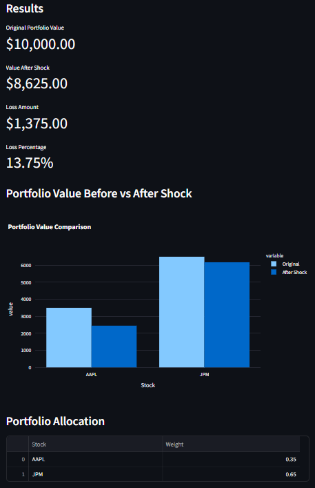
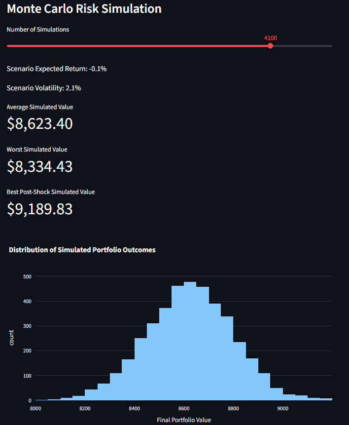
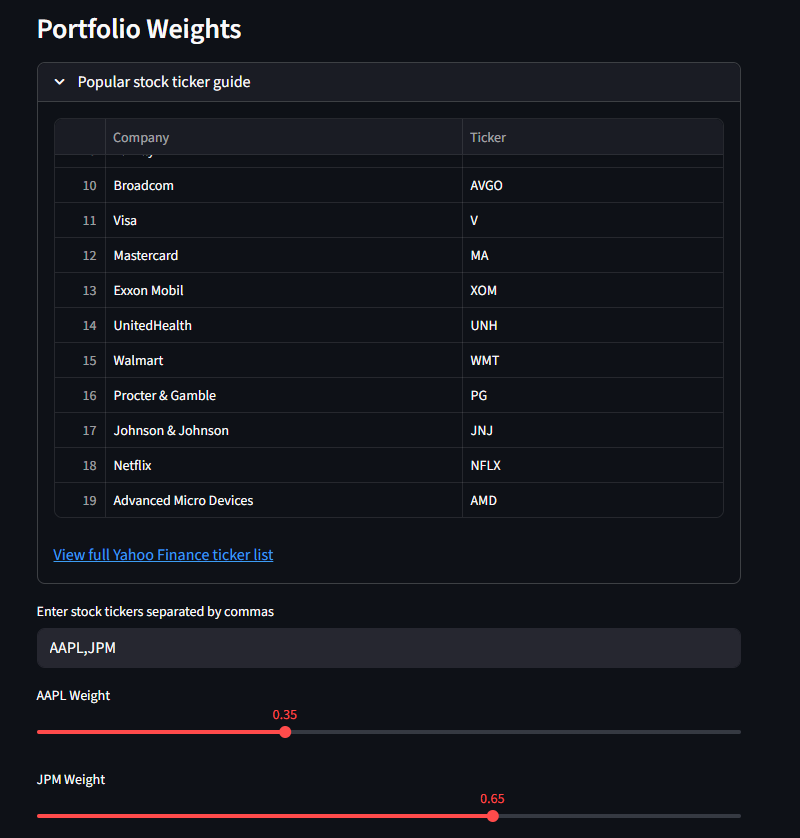

# Market Shock Simulator


A financial risk analytics dashboard that simulates how stock portfolios react to different market crash scenarios using sector-based shocks, historical market data, and Monte Carlo simulation.

## Features

- Dynamic multi-stock portfolio input
- Automatic sector detection using Yahoo Finance data
- Sector-based market shock scenarios
- Historical return and volatility estimation
- Monte Carlo risk simulation
- Interactive Plotly charts
- Popular stock ticker guide

## Dashboard Preview

### Main Dashboard


### Market Shock Analysis



### Monte Carlo Risk Simulation



### Dynamic Portfolio Builder


## How It Works

1. User enters stock tickers and portfolio weights
2. The app detects each stock's sector
3. A selected market scenario applies sector-specific shocks
4. Historical stock data is retrieved using Yahoo Finance
5. Historical returns and volatility are calculated
6. Monte Carlo simulation estimates post-shock portfolio outcomes
7. Interactive charts visualize portfolio risk and performance

## Shock Scenarios

- Tech Crash
- Banking Crisis
- Full Market Crash
- AI Bubble Burst
- Interest Rate Hike
- Oil Crisis
- Pandemic Shock
- AI Boom

## Tech Stack

- Python
- Streamlit
- pandas
- NumPy
- Plotly
- yfinance

## Installation

```bash
pip install -r requirements.txt